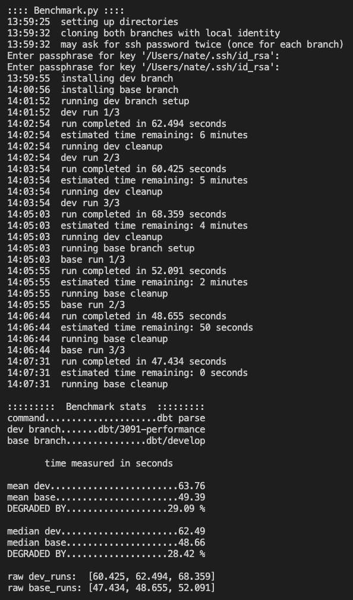

### dbt timing project
This repository contains command line tools to locally generate arbitrarily-sized projects and to compare benchmarks of dbt commands as seen in public github branches.

## Example Output



## Installation

```
pip install -r requirements.txt
```

## Usage

1. generate dbt project files
2. run benchmark.py

```
> python3 gen_files.py --help
usage: gen_files.py [-h] files

Generate a dbt project

positional arguments:
  files       specifies the number of files to be generated in the project

optional arguments:
  -h, --help  show this help message and exit
```

```
> python3 benchmark.py --help 
usage: benchmark.py [-h] [--cached] [--runs RUNS] command dev base

Benchmark two dbt branches

positional arguments:
  command       specifies the dbt command to benchmark. run as `dbt
                <command>`.
  dev           branch with changes to benchmark
  base          branch to compare against. typically "develop"

optional arguments:
  -h, --help    show this help message and exit
  --cached, -c  skips git clone and install steps.
  --runs RUNS   number of runs to test for each branch. defaults to 10.
```

## Examples

benchmark `dbt parse` on a small project:

```
python3 gen_files.py 10
python3 benchmark.py parse my-branch develop
```

re-run the same benchmark with 25 runs on each branch:

```
python3 benchmark.py --cached --runs=25 parse my-branch develop
```

to benchmark large projects generate ~2000 files.

## Future Improvements
- when using `--cached` the last two parameters do nothing but are still required. Should check that those names match the cloned repositories.
